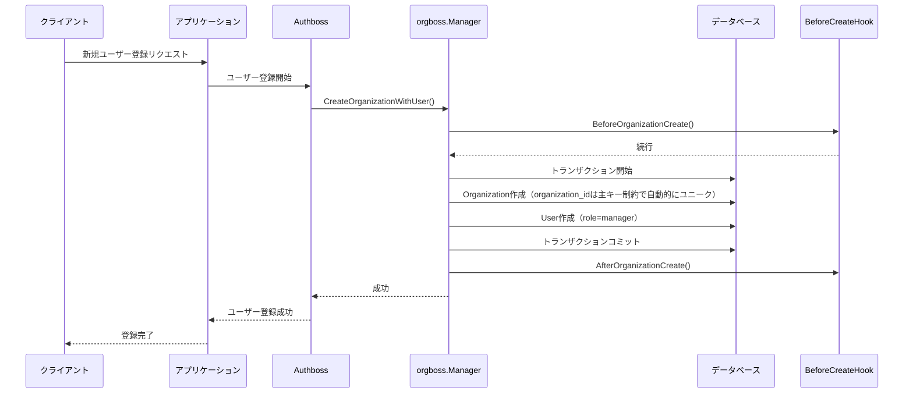
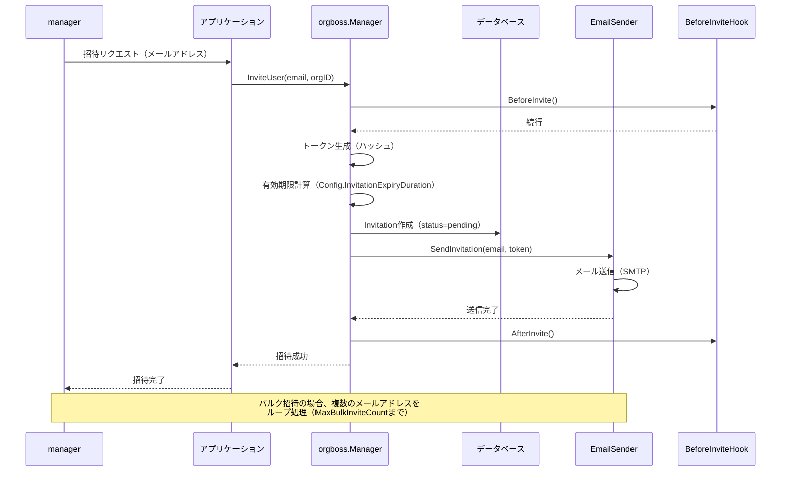
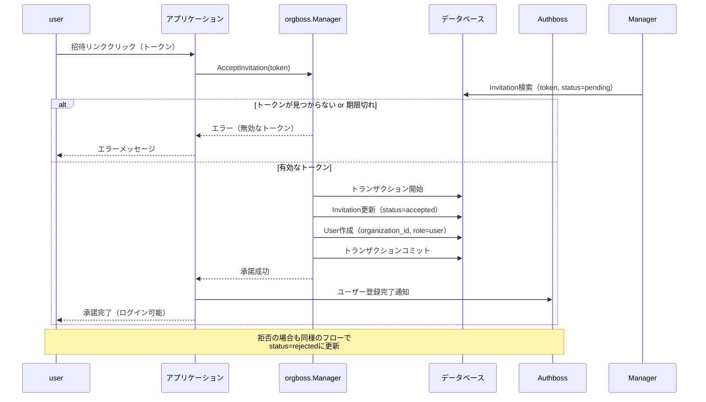
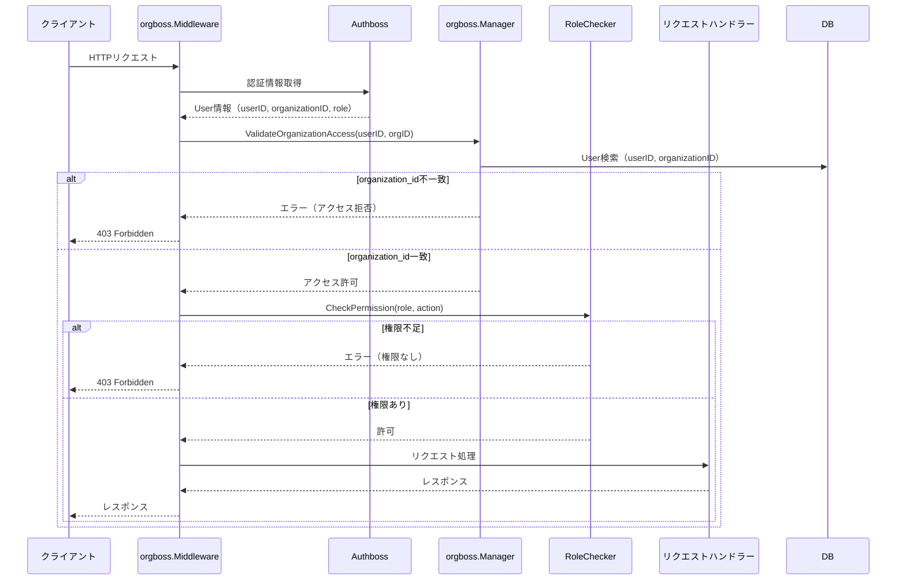
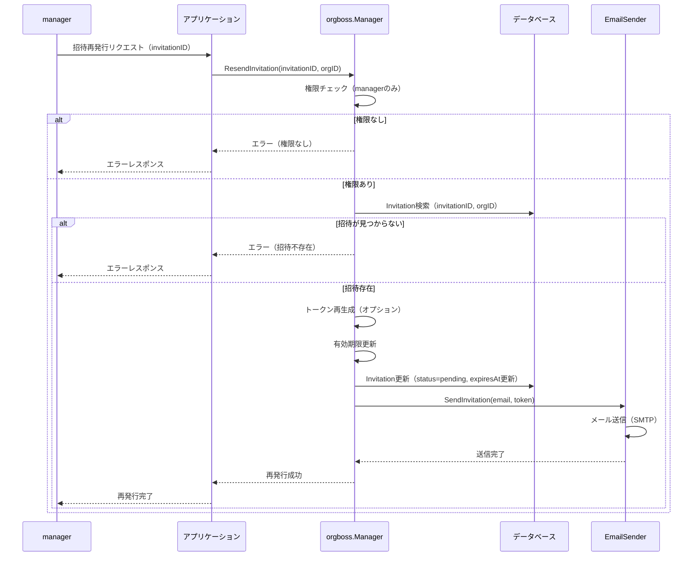
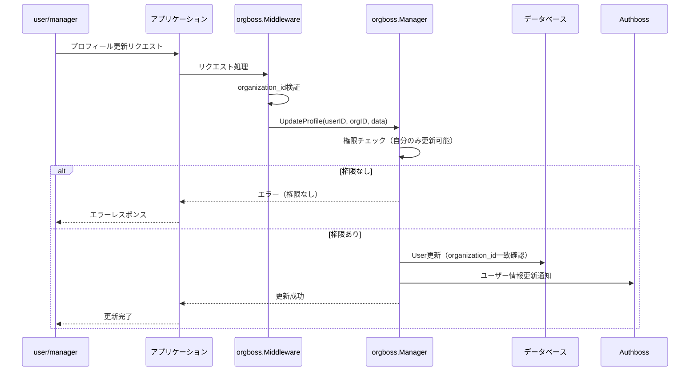
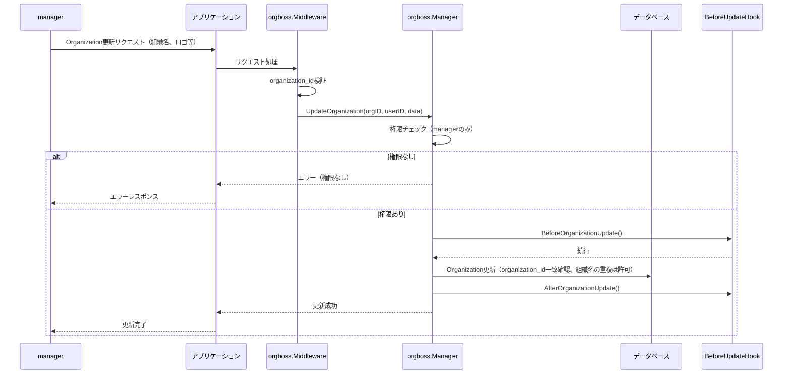

# orgboss 主要ロジック シーケンス図

## 1. 新規組織（Organization）作成

新規ユーザー登録時に、OrganizationとUserをトランザクションで同時作成する。



## 2. 組織への招待（単一・バルク）

managerがuserを招待する。バルク招待にも対応。



## 3. 招待の承諾・拒否

userが招待メールのリンクをクリックして承諾または拒否する。



## 4. ユーザー退会

user自身の退会、managerによるuser削除、manager退会の3パターン。

```mermaid
sequenceDiagram
    participant Actor as アクター<br/>(user/manager)
    participant App as アプリケーション
    participant ManagerAPI as orgboss.Manager
    participant DeletionHandler as DeletionHandler
    participant DB as データベース
    participant Hook as BeforeDeleteHook

    Actor->>App: 退会リクエスト
    App->>ManagerAPI: DeleteUser(userID, orgID)
    
    ManagerAPI->>ManagerAPI: 権限チェック
    alt 権限なし
        ManagerAPI-->>App: エラー（権限なし）
        App-->>Actor: エラーレスポンス
    else 権限あり
        ManagerAPI->>Hook: BeforeUserDelete()
        Hook-->>ManagerAPI: 続行
        
        ManagerAPI->>ManagerAPI: ロール判定
        alt manager退会
            ManagerAPI->>DeletionHandler: DeleteOrganization(orgID)
            DeletionHandler->>DB: Organization削除（論理/物理）
            DeletionHandler->>DB: 関連User削除（論理/物理/マスク）
            DeletionHandler-->>ManagerAPI: 削除完了
        else user退会
            ManagerAPI->>DeletionHandler: DeleteUser(userID)
            DeletionHandler->>DB: User削除（論理/物理/マスク）
            DeletionHandler-->>ManagerAPI: 削除完了
        end
        
        ManagerAPI->>Hook: AfterUserDelete()
        ManagerAPI-->>App: 退会成功
        App-->>Actor: 退会完了
    end
```

## 5. 権限チェック（ミドルウェア）

HTTPリクエスト時にorganization_idとロールを検証する。



## 6. 招待の再発行

managerが既存の招待を再送信する。



## 7. プロフィール更新

manager、userが自分のプロフィールを更新する。



## 8. Organization更新

managerがOrganizationの情報（組織名、ロゴなど）を更新する。



